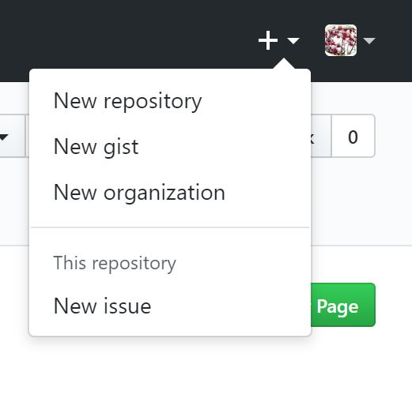
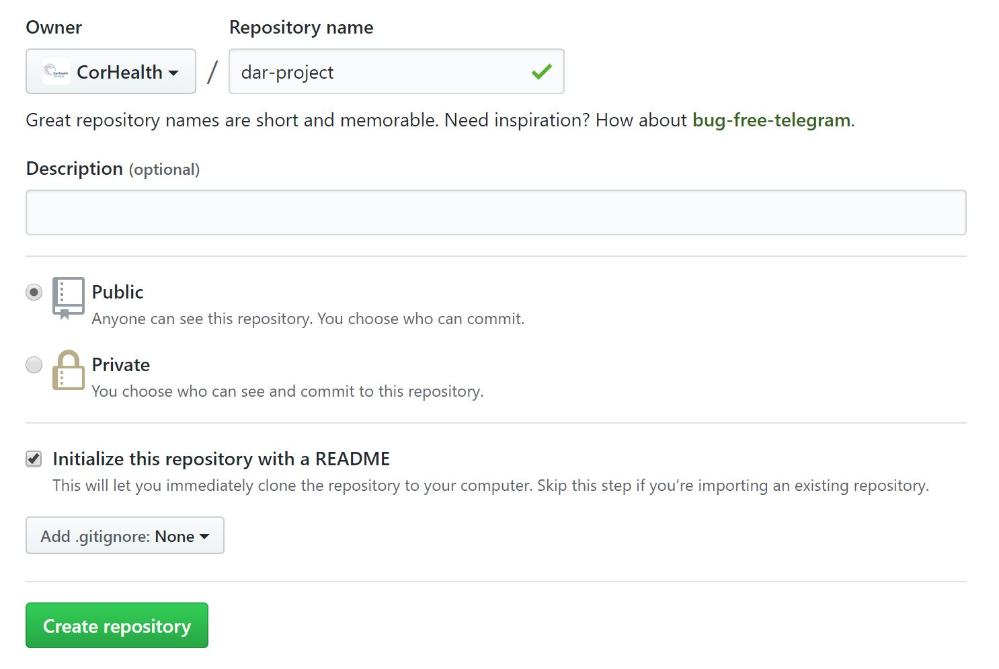

# Git Guide @CorHealth

## Install Git

* Download from the [Git web site](https://www.git-scm.com/download/win) and run the installer

* Or run command: `choco install git` if you have chocolatey installed on your machine

* To check git version:
`git --version`

## CorHealth GitHub Setup
Here are links for [CorHealth Git Production Site](https://ccnprdgithub.ccn.on.ca/) and [CorHealth Git Dev Site](https://ccndevgithub.ccn.on.ca/)

1. Login to CorHealth GitHub Enterprise Site by above link(s)
2. Create new organization 'CorHealthOntario' from the `+` drop down t top right corner of the screen

    

3. Create new project after navigate to organization ( _Optional, if use GitHub for issue management_)

	- From the 'Your Profile' page, click the Organization created in step 1, click 'Projects' menu item
	- Then click 'New' button to create the project

4. Create teams for organization after navigate to organization page from your profile. Suggested teams could  be:
	* Dev Team
	* QA Team
	* EQI Business Team
	* ...

5. Create new repository

	- From the 'Your Profile' page, click the Organization created in step 1, click 'Repositories' menu item
	- Then click the 'New' button, input repository name
	- Check the 'Initialize this repository with a README' checkbox, and then Click 'Create Repository' button
    
	- From the repository page, click 'Settings' menu tab and then select 'Collaborators & teams' from the left side menu, click the 'Add a team' button to setup users can visit the repository
	- from repository page, click 'Settings' tab, select 'Collabrators & teams' menu to assign teams permssion to this repository
	- From repository settings page, Enable GitHub Pages by select source as 'master branch'
	- sdfsdf

					sfkjdsfdsf

## Git UI Client
Most popular Git UI client applications could be found at: https://git-scm.com/downloads/guis
1. GitHub Desktop - Developed by GitHub
2. SourceTree
* [Todo] image to account setup

## Clone GitHub Repository to local
1. Clone Repository to local
* Option 1 - Use Git Command

	- Navigate to repository page from your GitHub account, select 'Https' icon to get repository's Git link, following is a sample link, click the copy icon could copy the link to the clipboard:
	`https://ccndevgithub.ccn.on.ca/CorHealth/report-wiki.git`
	- Open Git Bash (installed with Git installation), change to desired local folder
	- input following command:
	`git clone https://[your github account name]@ccndevgithub.ccn.on.ca/CorHealth/report-wiki.git`
    It will prompt your to input your github password, then it will clone the repository to your local

* Option 2 - Use GitHub Desktop

	- Naigate to repository page from your GitHub account, select 'Set up in Desktop' icon
	- Input the destination local folder, then click the OK button

* Option 3 - Use Source Tree Clone

## Pull/Push Code
1. Via SourceTree
* Click the Pull icon, check 'Rebase instead of merge' option, then click 'OK' button
* Work on local folder files, Stack code, Commit and then push the code

